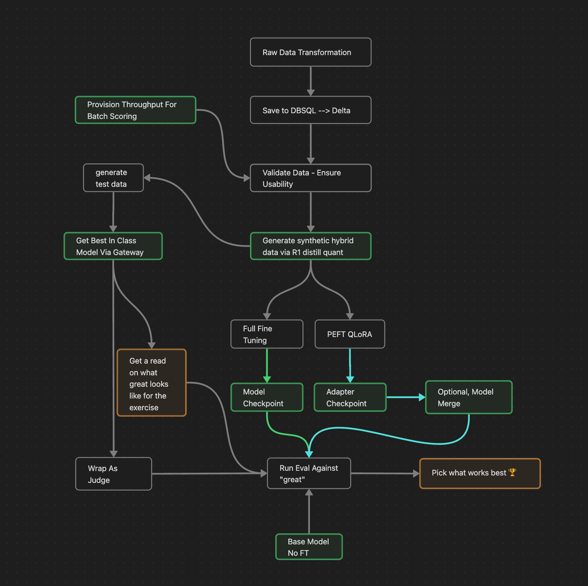

<<<<<<< HEAD
# Databricks-POC
This repository if the establishment of the Databricks POC which includes the work initiated by databricks.
=======
# Fine-Tuning and Distillation for High-Quality Models
#### Note: This readme was created using Claude 3.7 Sonnet

This repository contains a complete workflow for preprocessing raw data, fine-tuning language models, and using distillation techniques to create high-quality models. The project demonstrates the process from raw data preparation to model evaluation.

## Project Overview

This project showcases a complete pipeline for creating fine-tuned language models using a combination of local processing and Databricks-based machine learning:

1. Data preprocessing and cleaning
2. Data validation and quality assurance
3. Collection of reasoning traces from expert models
4. Fine-tuning using distilled knowledge
5. Custom evaluation of model performance
6. Bonus exploration with qLoRA fine-tuning of larger models


### Pipeline
The entire pipeline is shown in the image below:



## Workflow Steps

### 00. Dataset Preprocessing (Local)
`00-dataset_preprocessing_local.py`

- Loads raw data from `llm_sample_raw_data.jsonl` 
- Cleans and preprocesses text data
- Converts forum questions and answers to Alpaca instruction format
- Splits data into training and validation sets
- Outputs formatted data files: `alpaca_car_forum_data.jsonl`, `alpaca_car_forum_train.jsonl`, and `alpaca_car_forum_val.jsonl`

### 01. Databricks Upload (Local)
`01-databricks_upload_local.py`

- Connects to Databricks environment
- Uploads preprocessed datasets to Databricks tables
- Prepares data for cloud-based processing

### 02. Post-Load Validation
`02-post-load-validation.ipynb`

- Validates uploaded data in Databricks
- Performs quality checks on the dataset
- Prepares data for model training
- Executed in Databricks workspace

### 03. Collect Reasoning Model Traces
`03-collect-reasoning-model-traces.ipynb` (Databricks) and `03-collect_reasoning_traces_local.py` (Local)

- Collects reasoning traces from expert models
- Uses these traces for knowledge distillation
- Local version uses Ollama API for model inference
- Databricks version leverages cloud compute resources

### 04. Fine-tuning Using Forum Reasoning
`04-finetuning-using-forum-reasoning.ipynb`

- Implements fine-tuning techniques using distilled knowledge
- Trains models on forum data with expert reasoning traces
- Uses Databricks for distributed training
- Executed in Databricks workspace

### 05. Custom Evaluations
`05-custom-evals.ipynb`

- Implements custom evaluation metrics for fine-tuned models
- Compares model performance against baselines
- Analyzes model strengths and weaknesses
- Executed in Databricks workspace

### 06. Bonus: qLoRA Llama-3 70B and Evaluations
`06-bonus-qLoRA-llama33-70b-and-evals.ipynb`

- Explores parameter-efficient fine-tuning using qLoRA
- Applies techniques to the larger Llama-3 70B model
- Evaluates performance of the resulting model
- Executed in Databricks workspace

## Requirements

```
ipykernel==6.29.5
rich==13.11.0
scikit-learn==1.6.1
pandas==2.1.4
ruff==0.1.1
databricks-sql-connector==4.0.0
argparse==1.0.0
typing==4.11.0
databricks-connect==16.1.0
openai==1.65.2
python-dotenv==1.0.1
```

## Setup Instructions

1. Clone this repository
2. Create a virtual environment: `python -m venv .venv`
3. Activate the environment:
   - Windows: `.venv\Scripts\activate`
   - MacOS/Linux: `source .venv/bin/activate`
4. Install dependencies: `pip install -r requirements.txt`
5. Create a `.env` file with necessary API credentials
6. Configure Databricks connection

## Execution

- Run local scripts (ending with `_local`) in your local environment
- Execute notebooks in Databricks workspace for cloud-based processing
- Follow the numbered sequence from 00 to 06 for the complete workflow

## Results

The project demonstrates how to effectively use knowledge distillation techniques to create high-quality fine-tuned models that capture the reasoning capabilities of larger expert models while being more efficient to deploy and use.

>>>>>>> a788648372c65cfe2095c0a466489c12b1973d6e
